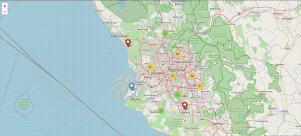

# Property Finder (2017)

A tool to collect and search property listings — built to help me find and buy my current house in KL.

Scraped listings from iproperty.com.my, filtered by budget and area, and plotted them on an interactive map to compare options visually. It worked. I bought the house.



## Motivation

Searching for properties across multiple platforms manually was tedious. This automated the collection and gave me a searchable, visual dataset to work from.

## What It Did

1. **Crawler** — Scrapy spider scraped iproperty.com.my for listings matching budget and area (configured via `house_conf.ini`). Two spiders ran concurrently for low and high budget ranges. Results saved to CSV.

2. **Web App** — Flask app read the CSVs and plotted listings on a Folium map with price, size, location, and a direct link back to each listing.

## Structure

```
crawler/    — Scrapy project (spider, pipeline, settings, config)
webapp/     — Flask app (map visualisation, table view)
data/       — Actual crawled CSVs from August 2017
```

## Stack

`Python` · `Scrapy` · `Flask` · `Folium` · `Pandas`

## Status

Not maintained. The crawler no longer runs — iproperty.com.my has changed significantly since 2017. The code and original crawled data are preserved as-is.
